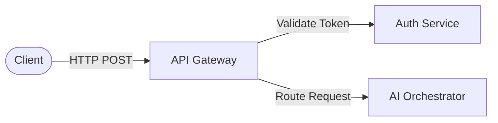
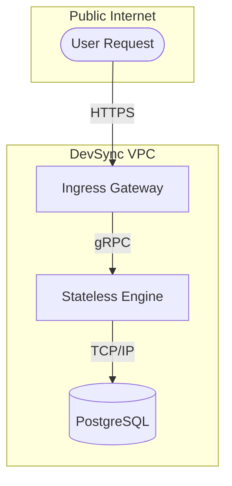
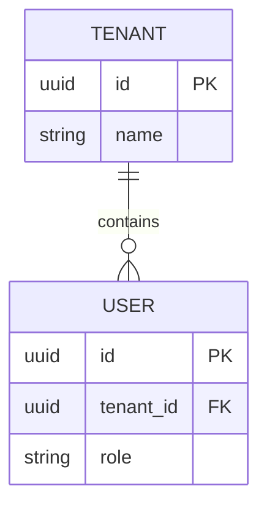

# Purpose

This document establishes the official standards, practices, and guidelines for all engineering documentation at DevSync. It serves as the definitive source of truth for how technical knowledge is captured, structured, and disseminated across the organization.

**Why this exists:** Documentation is not an afterthought; it is a core engineering artifact. Without a unified standard, documentation becomes fragmented, contradictory, and obsolete. This guide ensures that regardless of the author—whether a Staff Software Architect, a Technical Writer, or a Junior DevOps Engineer—the resulting documentation is uniform, predictable, and highly functional. Consistency reduces cognitive load for readers, accelerates onboarding, and minimizes friction when transferring ownership of systems.

# Goals

1.  **Maintain Single Source of Truth:** Eliminate duplicate information and ensure readers can trust the documentation they find.
2.  **Optimize for Readability:** Prioritize the reader's time over the writer's convenience. Information must be scannable, precise, and unambiguous.
3.  **Ensure Maintainability:** Treat documentation like code. It must be versioned, reviewed, and refactored.
4.  **Enforce Structural Predictability:** Guarantee that any engineer can navigate an unfamiliar domain's documentation because the structure mirrors every other domain.

**Why these goals exist:** DevSync operates as an AI Infrastructure Platform connecting disparate software systems. The complexity of our domain requires uncompromising clarity. Ambiguity in our internal documentation translates to architectural flaws, security vulnerabilities, and degraded developer experience.

# Documentation Philosophy

At DevSync, we adhere to the following philosophical tenets for technical writing:

*   **Documentation is Code:** Documentation lives in version control, undergoes code review, and is subject to continuous integration checks.
*   **Write for the Uninitiated:** Assume the reader possesses general engineering competency but zero domain-specific context.
*   **Decentralized Authorship, Centralized Standards:** Anyone can write documentation, but everyone must adhere strictly to this style guide.
*   **Obsolescence is a Liability:** Outdated documentation is worse than no documentation. If a system changes, its documentation must change synchronously.

**Why this philosophy exists:** A culture that treats documentation as a second-class citizen will eventually succumb to institutional amnesia. By treating documentation with the same rigor as production code, we ensure the longevity and stability of the DevSync platform.

# Writing Principles

### 1. Active Voice
Use the active voice exclusively. The subject of the sentence must perform the action.

*   **Correct:** The orchestration engine routes the payload.
*   **Incorrect:** The payload is routed by the orchestration engine.
*   **Why this exists:** Active voice is more direct, uses fewer words, and unambiguously identifies the actor responsible for an operation.

### 2. Imperative Mood for Instructions
When providing steps or commands, use the imperative mood.

*   **Correct:** Run the deployment script.
*   **Incorrect:** You should run the deployment script.
*   **Why this exists:** It eliminates unnecessary conversational padding and clearly signals an actionable step.

### 3. Precision over Verbosity
Use exact terminology. Do not use synonyms for established domain concepts.

*   **Correct:** Initiate the OAuth 2.0 authorization code flow.
*   **Incorrect:** Start the login process to get access.
*   **Why this exists:** Technical writing demands precision. Synonyms introduce ambiguity and force the reader to infer whether a distinction was intended.

### 4. Present Tense
Describe system behavior in the present tense.

*   **Correct:** The API returns a 404 status code when the resource is missing.
*   **Incorrect:** The API will return a 404 status code when the resource is missing.
*   **Why this exists:** The system currently exists and operates. Future tense implies a roadmap feature rather than current functionality.

# Markdown Standards

DevSync utilizes GitHub Flavored Markdown (GFM) exclusively. No HTML tags are permitted unless absolutely necessary for rendering complex tables that Markdown cannot support.

### Rules

1.  **Hard Wrapping:** Do not hard-wrap lines at 80 characters. Let the text editor handle visual wrapping.
    *   **Why this exists:** Hard wrapping causes unnecessary merge conflicts and complicates text reflowing during edits.
2.  **Unordered Lists:** Use hyphens (`-`) for unordered lists, never asterisks (`*`).
    *   **Why this exists:** Enforces uniformity in the raw Markdown source.
3.  **Bold and Italic:** Use double asterisks (`**`) for bold and single underscores (`_`) for italics.
    *   **Why this exists:** Standardizes syntax and prevents visual inconsistency in the source files.
4.  **Code Spans:** Enclose filenames, variables, and short commands in single backticks (`\``).

# Heading Hierarchy

Headings must follow a strict semantic hierarchy. Never skip heading levels (e.g., do not jump from H1 to H3).

*   `#` (H1): Document Title. Used exactly once per document.
*   `##` (H2): Major Sections.
*   `###` (H3): Subsections.
*   `####` (H4): Minor group headings.

**Why this exists:** Proper heading hierarchy ensures accessibility for screen readers and allows automated tools to generate accurate Tables of Contents.

**Example:**
```markdown
# Database Connection Pooling

## Configuration

### PostgreSQL Settings

#### Timeout Parameters
```

# Naming Convention

All entities referenced in documentation must use their canonical names.

*   **Acronyms:** Spell out acronyms on their first use in a document, followed by the acronym in parentheses. Example: `Role-Based Access Control (RBAC)`.
*   **Product Names:** Always capitalize DevSync properly. Never use "Devsync", "devSync", or "devsync" in prose.
*   **Variable/Function Names:** Must match the source code exactly, matching case and convention (e.g., `camelCase`, `snake_case`).

**Why this exists:** Consistency prevents confusion and ensures searchability across the repository.

# Folder Structure Rules

Documentation must be organized hierarchically by domain, not by document type.

### Rules
1.  **Numbered Directories:** Root directories must be numbered to enforce logical ordering (e.g., `01-company`, `02-product`).
2.  **No Deep Nesting:** Directories should not exceed three levels deep (`root/domain/subdomain/file.md`).
3.  **Index Files:** Every directory must contain a `README.md` that explains the contents of that directory.

**Why this exists:** A flat, predictable directory structure prevents the documentation repository from becoming a labyrinth. Numbering ensures that critical domains appear first in file tree views.

# Mermaid Diagram Standards

Mermaid is the official and only supported tool for rendering diagrams. Do not upload static image files (PNG, JPEG) for diagrams that can be expressed in Mermaid.

### Rules
1.  **Direction:** Use Top-to-Bottom (`TD`) or Left-to-Right (`LR`) consistently based on the flow.
2.  **Styling:** Do not apply custom CSS classes or colors to nodes. Rely on the default GitHub Mermaid theme.
3.  **Labels:** Every edge indicating a process must have a label.

**Why this exists:** Mermaid allows diagrams to be version-controlled, searched, and edited via pull requests without requiring external design software. Avoid custom styling to maintain compatibility with dark/light modes.

**Example:**


# Architecture Diagram Standards

Architecture diagrams must clearly delineate system boundaries, trust zones, and data flow.

### Rules
1.  **Boundaries:** Use Mermaid subgraphs to define VPCs, clusters, or service boundaries.
2.  **Protocols:** Edges between disparate systems must explicitly state the protocol (e.g., gRPC, HTTPS).
3.  **State:** Differentiate stateless compute services from stateful storage layers.

**Why this exists:** Vague architecture diagrams are dangerous. Engineers must know exactly how services communicate and where data is persisted to make informed design decisions.

**Example:**


# Database Diagram Standards

Entity-Relationship (ER) diagrams must use Mermaid's `erDiagram` syntax.

### Rules
1.  **Cardinality:** Relationships must explicitly define cardinality (one-to-one, one-to-many, etc.).
2.  **Keys:** Primary keys (PK) and foreign keys (FK) must be labeled.
3.  **Types:** Include data types for critical columns.

**Why this exists:** Database schemas represent the hard state of the application. Misunderstanding cardinality leads to N+1 query problems and data corruption.

**Example:**


# Code Block Standards

All code examples must be encapsulated in fenced code blocks with the appropriate language identifier.

### Rules
1.  **Language Tags:** Always specify the language (e.g., `python`, `json`, `bash`).
2.  **Executable:** Code snippets must be syntactically correct. Do not use pseudo-code unless explicitly stated.
3.  **Context:** Provide sufficient context (e.g., imports) or clearly indicate omitted code using comments.

**Why this exists:** Syntax highlighting drastically improves readability. Incorrect or un-runnable code examples erode trust in the documentation.

**Example:**
```python
import os
from devsync import Orchestrator

# Initialize the engine
engine = Orchestrator(api_key=os.environ["DEVSYNC_KEY"])
```

# API Documentation Standards

API documentation must be generated from OpenAPI (Swagger) or GraphQL schemas. Hand-written API documentation is strictly prohibited.

### Rules
1.  **Schema First:** Changes to the API must begin with a schema change.
2.  **Descriptions:** Every endpoint, parameter, and response property must have a description in the schema.
3.  **Status Codes:** Document all possible HTTP status codes, including errors (4xx, 5xx).

**Why this exists:** Hand-written API docs inevitably drift from the actual implementation. Schema-driven documentation guarantees accuracy and allows for automatic SDK generation.

# AI Documentation Standards

Documenting non-deterministic AI systems requires specific parameters not found in traditional software.

### Rules
1.  **Model Provenance:** Specify the exact LLM or model version utilized for a feature (e.g., `gpt-4-turbo-0125-preview`).
2.  **Prompt Constraints:** Document the system prompt template and any injected variables.
3.  **Temperature/Parameters:** List the temperature, top_p, and frequency penalties used.
4.  **Failure Modes:** Explicitly state known hallucination risks or edge cases for the specific workflow.

**Why this exists:** AI behavior changes based on underlying models and prompt engineering. Without documenting these parameters, it is impossible to debug regressions in AI performance.

# Connector Documentation Standards

Connectors are the lifeblood of DevSync. Their documentation must follow a rigid structure.

### Rules
1.  **Authentication Profile:** Detail exactly how the connector authenticates with the external system (OAuth2, Bearer Token, Mutual TLS).
2.  **Scopes/Permissions:** List the exact permissions required on the external system.
3.  **Rate Limits:** Document the external system's rate limits and how the connector handles backoff strategies.
4.  **Data Mapping:** Map the external system's data model to DevSync's unified schema.

**Why this exists:** Connectors interact with systems we do not control. Thorough documentation is required to diagnose integration failures and guide users through complex setup processes.

# Security Documentation Standards

Security documentation must be explicit, instructional, and unambiguous.

### Rules
1.  **Threat Models:** Document the assumed threat model for critical components.
2.  **Secrets Management:** Specify exactly how secrets are injected into the environment. Never include real secrets in documentation.
3.  **RBAC Matrices:** Use tables to map user roles to permitted actions.

**Why this exists:** Security relies on absolute clarity. Ambiguous security guidelines lead to misconfigurations, which lead to breaches.

# Decision Record Standards

We use Architecture Decision Records (ADRs) to document significant engineering choices.

### Rules
1.  **Context:** Explain the forces at play and the technical context.
2.  **Decision:** State the decision clearly.
3.  **Consequences:** Document both positive and negative consequences (trade-offs) resulting from the decision.
4.  **Immutability:** Once an ADR is accepted, it is immutable. If the decision changes, write a new ADR that supersedes the old one.

**Why this exists:** To prevent the "why did we do it this way?" question months after a decision was made, and to prevent revisiting settled arguments.

# RFC Standards

Request for Comments (RFCs) are used for proposed changes to architecture or processes.

### Rules
1.  **Problem Statement:** Clearly articulate the problem before proposing a solution.
2.  **Proposed Solution:** Detail the technical approach.
3.  **Alternatives Considered:** You must list at least one alternative and explain why it was rejected.

**Why this exists:** RFCs democratize technical design and ensure that major changes undergo rigorous peer review before implementation begins.

# Changelog Standards

Changelogs must follow the "Keep a Changelog" format.

### Rules
1.  **Categorization:** Group changes under `Added`, `Changed`, `Deprecated`, `Removed`, `Fixed`, and `Security`.
2.  **User-Centric:** Write changelogs for the user (developer or client), not the internal engineer.
3.  **Links:** Link to the relevant PR or issue.

**Why this exists:** Git commit history is too noisy and lacks business context. A curated changelog communicates value and breaking changes to consumers.

# Versioning Rules

All DevSync software adheres strictly to Semantic Versioning (SemVer) 2.0.0.

### Rules
1.  **MAJOR:** Increment for incompatible API changes.
2.  **MINOR:** Increment for adding functionality in a backward-compatible manner.
3.  **PATCH:** Increment for backward-compatible bug fixes.

**Why this exists:** Predictable versioning manages consumer expectations and prevents accidental breakage of client integrations.

# File Naming Rules

File names must be deterministic and predictable.

### Rules
1.  **Kebab-case:** Use lower kebab-case for all Markdown files (e.g., `system-architecture.md`).
2.  **No Spaces:** Spaces are strictly forbidden in file names.
3.  **Extensions:** Always use the `.md` extension for Markdown.

**Why this exists:** Case sensitivity differs across operating systems (macOS vs. Linux). Enforcing lowercase kebab-case prevents cross-platform build failures and URL routing issues.

# Cross Reference Rules

When referencing another concept or system within the text, you must provide a reference if it exists.

### Rules
1.  **Contextual Linking:** Do not write "Click here". The link text must be the subject itself.
    *   **Correct:** Refer to the [Routing Engine](#) documentation.
    *   **Incorrect:** For routing, click [here](#).

**Why this exists:** "Click here" harms accessibility and provides zero context when read out of flow.

# Internal Linking Rules

Internal links must use relative paths, never absolute URLs.

### Rules
1.  **Relative Paths:** Link using `./` or `../` syntax.
2.  **Anchors:** Link directly to the relevant heading using `#heading-name`.
3.  **No Hardcoded Domains:** Never include `https://github.com/devsync/...` in internal links.

**Why this exists:** Relative paths ensure documentation remains navigable locally, in PR previews, and across different environments without breaking links.

# Tables

Tables should be used for comparing structured data.

### Rules
1.  **Alignment:** Left-align text columns. Right-align numerical data.
2.  **Headers:** Every table must have a header row.
3.  **Brevity:** Keep table cells concise. If a cell requires multiple paragraphs, a table is the wrong format.

**Why this exists:** Tables organize dense data but break down visually if cells contain overly verbose text.

**Example:**
| Role | Read Access | Write Access | Delete Access |
| :--- | :--- | :--- | :--- |
| Admin | Yes | Yes | Yes |
| Editor | Yes | Yes | No |
| Viewer | Yes | No | No |

# Images

Images should be used sparingly and only when textual description or Mermaid diagrams are insufficient.

### Rules
1.  **Format:** Use SVG or WebP where possible. PNG is acceptable for UI screenshots.
2.  **Alt Text:** Every image must have descriptive alt text for accessibility.
3.  **Location:** Store images in a dedicated `assets/` directory within the relevant domain folder.

**Why this exists:** Images bloat repository size and cannot be searched or easily updated. Alt text is legally required for accessibility compliance.

# Screenshots

Screenshots are highly volatile and should be avoided for rapidly changing UI.

### Rules
1.  **Focused:** Crop screenshots to highlight only the relevant UI component. Do not include the entire browser window or OS chrome.
2.  **Annotations:** Use standard red/magenta outlines or arrows to highlight specific areas if necessary.
3.  **No PII:** Ensure no Personally Identifiable Information is visible in any screenshot.

**Why this exists:** Uncropped screenshots become outdated quickly and are difficult to read on smaller screens. PII leakage in documentation is a severe security violation.

# Notes

Use blockquotes to denote supplementary information.

### Rules
1.  **Formatting:** Use the `> [!NOTE]` GitHub alert syntax.
2.  **Usage:** Reserve notes for context that is helpful but not strictly required to complete a task.

**Why this exists:** Standardized callouts draw attention without disrupting the primary flow of the document.

**Example:**
> [!NOTE]
> The background worker polls the queue every 5 seconds by default.

# Warnings

Use warnings to highlight actions that have negative, but non-destructive, consequences.

### Rules
1.  **Formatting:** Use the `> [!WARNING]` GitHub alert syntax.
2.  **Usage:** Use for actions that cause performance degradation, temporary lockouts, or unintended state changes.

**Why this exists:** Readers scan technical documents. Visual warnings ensure they do not miss critical caveats.

**Example:**
> [!WARNING]
> Updating the schema will cause a brief period of degraded read performance.

# Best Practices

When documenting how to use a tool or API, explicitly list best practices.

### Rules
1.  **Actionable:** A best practice must be an actionable recommendation, not a philosophical statement.
2.  **Justification:** Briefly explain the benefit of the practice.

**Why this exists:** It guides developers toward optimal usage patterns rather than just mechanically correct ones.

# Anti Patterns

Explicitly document what *not* to do.

### Rules
1.  **Contrast:** Pair the anti-pattern with the recommended approach.
2.  **Consequence:** Explain exactly what fails or degrades if the anti-pattern is used.

**Why this exists:** Engineers often learn best by understanding the boundaries of a system and the specific pitfalls to avoid.

# Examples

Provide concrete examples for abstract concepts.

### Rules
1.  **Realistic Data:** Use realistic, plausible data in examples (e.g., `user_id: "usr_29dn39x"`). Do not use `foo`, `bar`, or `test`.
2.  **Complete Snippets:** Ensure the example contains enough context to be understandable without reading the entire document.

**Why this exists:** Abstract explanations are difficult to parse. Concrete examples bridge the gap between theory and implementation.

# Checklist Before Merging Documentation

Every Pull Request containing documentation must pass this checklist:

- [ ] I have read the documentation aloud to verify flow and clarity.
- [ ] I have checked all internal and external links to ensure they resolve correctly.
- [ ] I have verified that all code snippets execute successfully as written.
- [ ] I have used the active voice and present tense.
- [ ] I have included alt text for any uploaded images.
- [ ] I have verified that Mermaid diagrams render correctly in the GitHub preview.

**Why this exists:** A checklist shifts the burden of quality control from the reviewer back to the author, ensuring higher quality submissions.

# Future Improvements

This style guide is a living document. As DevSync grows, our documentation needs will evolve.

### Planned Initiatives
1.  **Automated Linting:** Implementation of `markdownlint` and `vale` in CI pipelines to programmatically enforce these writing standards.
2.  **Link Checking Automation:** Integration of dead-link checkers on all pull requests.
3.  **Docs-as-Code Platform:** Evaluation of moving from raw GitHub markdown rendering to a specialized documentation framework (e.g., Nextra, Docusaurus) for enhanced search and navigation.

**Why this exists:** Acknowledging the roadmap for documentation tooling ensures the company treats the documentation infrastructure as a first-class engineering product requiring continuous investment.
